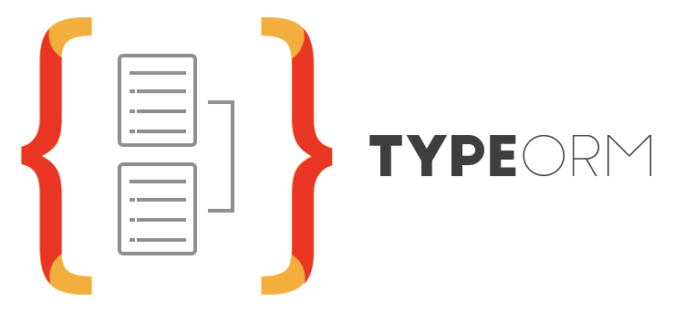
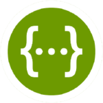
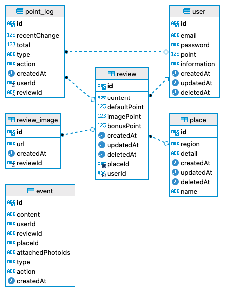

# ✈️ 트리플여행자 클럽 마일리지 서비스


### 📑 목차

---

- [✈️ 트리플여행자 클럽 마일리지 서비스](#️-트리플여행자-클럽-마일리지-서비스)
    - [📑 목차](#-목차)
  - [🚀 실행 방법](#-실행-방법)
  - [🤔 서비스 분석 및 구현 전략](#-서비스-분석-및-구현-전략)
  - [🏁 Git Convention](#-git-convention)
  - [💻 기술 스택](#-기술-스택)
  - [💾 ERD 설계](#-erd-설계)
  - [🧰 폴더 구조](#-폴더-구조)

## 🚀 실행 방법

---

**서버 실행 커맨드**

```
cd triple-project/
docker-compose build
docker-compose up
```

**swagger 주소**

- docker로 서버 실행 후
- http://localhost:3001/api-docs/ 로 접속
- swagger api-docs에서 api를 테스팅하실 수 있습니다

<br>

</br>

## 🤔 서비스 분석 및 구현 전략

---

**서비스 분석**

- 여행자가 리뷰 글을 작성하거나 이미지를 업로드함에 따라 포인트를 획득
- 수정, 삭제 시에 포인트 변동
  - 리뷰 생성, 수정, 삭제 기본 비즈니스 로직을 구성하면서도 영향을 주지 않기 위해 이벤트 처리를 해야 한다고 판단

**구현 전략**

- 따라서 리뷰에 관한 api가 실행시, 동시에 진행되는 이벤트 로직을 분리해야겠다고 판단
- CQRS 패턴의 event-eventHandler 기능을 사용하기로 결정했습니다
  - CQRS는 커맨드(Command)와 쿼리(Query)를 분리, 즉 쓰기와 읽기를 분리하여 성능을 높이는데 이용됩니다.
  - 읽기와 쓰기 간의 큰 성능 차이가 있는 경우, 이를 분리시켜 사용하여 성능을 높입니다
  - 한번의 호출에 필요한 기능이 여러개인 경우에도 사용하면 성능을 크게 높일 수 있다고 판단했고 이는 이벤트 기반 프로그래밍 모델과 친화적이라고 생각했습니다.
  - @nestjs/cqrs 모듈을 사용해 리뷰 CUD 로직과 이벤트 로그, 포인트 로그&포인트 수정 로직을 분리하여 요구사항의 로직을 구현하였습니다.
- 도커를 활용하여 리눅스 환경에서 작업했습니다

<br>

</br>

## 🏁 Git Convention

---

- **Commit message**

  - 🎉 INIT : 프로젝트 초기 환경 구축
  - ✨ ADD : 기능 신규 개발
  - 🎨 MODIFY : 기존 기능 수정
  - ⚡️ REFACTOR : 기존 기능 개선
  - 🐛 FIX : 버그 수정
  - 🔥 REMOVE : 불필요한 로직,폴더,파일 제거
  - 📝 DOC : 문서 정리 및 주석 추가
  - Git issue 관련 내용 상세
    - Resolve: #이슈 넘버 (이슈를 해결함)
    - Ref: #이슈 넘버 (이슈 참고)
    - Relate: #이슈 넘버 (관련된 이슈)

- 예시

  ```bash
  ✨ ADD / 00기능을 구현하였습니다.

  - 00기능을 구현하였습니다.
  - ~~ 코드를 수정하였습니다.

  Resolve: #00
  Ref: #00
  Relate: #00
  ```

- **Branch name**

  - main 브랜치 하나만 사용

- **issue**
  - 이슈 템플릿을 이슈 정리
  - 작업별 이슈를 만들어 커밋 정리
  - [프로젝트 Issue](https://github.com/leokim1178/Triple-Mileage-Service/issues)

## 💻 기술 스택

---

<br>
<div align='center'> 🖥&nbsp&nbsp&nbsp사용한 기술 스택</div>
<br>
<p align="center">
📑&nbsp&nbsp&nbsp구성 언어
  </p>
<p align="center">


  </p>
 <p align="center">
🏠&nbsp&nbsp&nbsp데이터베이스
  </p>
<p align="center">

&nbsp&nbsp&nbsp &nbsp

  </p>
<p align="center">
🏖&nbsp&nbsp&nbspWith...
  </p>
<p align="center">

&nbsp&nbsp

&nbsp&nbsp

&nbsp&nbsp

</p>

<br>

</br>

## 💾 ERD 설계

---



- 관계 설명
  - 리뷰 1:N 이미지
  - 리뷰 1:N 포인트 로그
  - 리뷰 N:1 유저
  - 리뷰 N:1 여행지
  - 유저 1: N 포인트 로그
- 이벤트 테이블은 관계를 이어줄 필요가 없다고 판단해 구성하지 않았습니다

<br>

</br>

## 🧰 폴더 구조

---

```
🚞 Triple-Mileage-Service
├─ 📑 README.md
├─ ddl.sql : ddl 파일
├─ images : readme용 이미지 폴더
└─ triple-project
   ├─ 🐳 Dockerfile : 도커 파일
   ├─ 🐳 docker-compose.yaml : 도커 컴포즈 파일
   ├─ 🎒 package.json
   └─ 🚈 src
      ├─ 🏝 apis
      │  ├─ event : 이벤트 & 이벤트 핸들러
      │  ├─ place : 여행지
      │  ├─ pointLog : 포인트 로그
      │  ├─ review : 리뷰
      │  ├─ reviewImage : 리뷰 이미지
      │  └─ user : 유저
      ├─ 💡 common : 전역 폴더
      │  ├─ config : 설정 폴더
      │  │  └─ 🗳 swagger
      │  │     └─ baseApiDocs.ts : 스웨거 설정
      │  └─ 🕹 filter
      │     └─ http-exception-filter.ts : 예외 처리 필터
      ├─ 🏠 app.module.ts
      └─ 📡 main.ts
```

##
